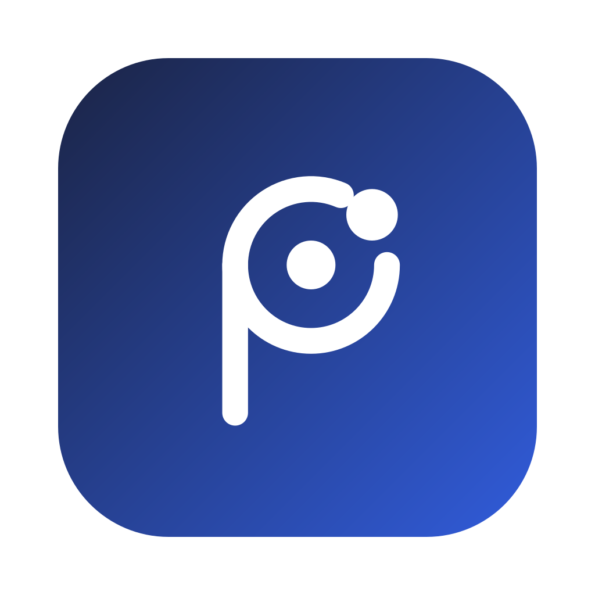

<p align="center"></p>

# Pilion Browser

**English:** Pilion is a desktop browser for [Agent Client Protocol](https://agentclientprotocol.com) agents. The left pane manages tabs and history, the middle shows the web page, and the right pane talks to any ACP agent, local (Claude Code, Codex, Gemini CLI, Grok Build, OpenCode, Pi, Orca, Blade) or remote over SSH. The browser hands its own tabs to the agent through MCP (`browser_snapshot`, `browser_screenshot`, navigate, click, type), with approval-before-action, human takeover and session resume. Builds for macOS, Windows and Linux are on the [Releases](https://github.com/echoVic/pilion-browser/releases) page; they are not code-signed yet, see [安装](#安装). MIT licensed.

面向人机协作的桌面浏览器。左侧管理标签和工作记录，中间浏览网页，右侧通过 ACP 与本地或远端 Agent 协作。

## 安装

从 [Releases](https://github.com/echoVic/pilion-browser/releases) 下载对应平台的安装包：macOS 为 dmg，Apple Silicon 选 arm64，Intel 选 x64；Windows 为 exe 安装程序；Linux 为 AppImage 或 deb。

当前安装包尚未签名和公证。macOS 首次打开会提示「已损坏」或「无法验证开发者」，把应用拖入「应用程序」后在终端执行一次：

```bash
xattr -cr /Applications/Pilion.app
```

Windows 会出现 SmartScreen 提示，选择「仍要运行」。

## 运行

需要 Node.js 22.13+ 和 pnpm 10。桌面应用基于 Electron 44。

```bash
pnpm install
pnpm build
pnpm start
```

开发模式为 `pnpm dev`。Vite 地址仅用于界面预览；真实网页、Agent、审批与持久化需要 Electron。

## 本地 Agent

在「Agent 连接 → 本地 Agent」中直接选择 Claude Code、Codex、Gemini CLI、Grok Build、OpenCode、Pi、Orca 或 Blade。应用自动检测已有 CLI 和 ACP 适配器；可手动指定 Node.js 路径，也可用文件夹按钮选择工作目录。默认使用 userData 下的独立 `workspace-files` 目录。

已安装的 ACP 适配器优先复用，包括旧版 `claude-code-acp`。缺少适配器时显示「安装并连接」，通过 npx 安装并缓存固定版本：Claude 使用 `@agentclientprotocol/claude-agent-acp@0.75.1`，Codex 使用 `@agentclientprotocol/codex-acp@1.10.0`。Gemini 直接使用 CLI 的 ACP 模式，缺少 CLI 时使用 `@google/gemini-cli@0.58.0`。不会修改全局 CLI 安装。

浏览器 MCP 同时提供 `browser_snapshot` 和 `browser_screenshot`：前者返回 URL、标题、loading、可见文字和元素语义，后者返回当前标签页 PNG。Agent 可以结合结构化页面状态与视觉页面状态决定下一步操作。

| Agent      | ACP 启动方式                   | 首次安装                                    |
| ---------- | ------------------------------ | ------------------------------------------- |
| Grok Build | `grok agent --no-leader stdio` | 复用官方 Grok Build CLI，缺少时提示安装     |
| OpenCode   | `opencode acp`                 | `opencode-ai@1.18.29`                       |
| Pi         | `pi-acp`                       | `@automatalabs/pi-acp@0.6.3`                |
| Orca       | `orca --mode=acp`              | `@blade-ai/orca@0.4.31`，或官方原生安装脚本 |
| Blade      | `blade --acp`                  | `blade-code@0.10.205`                       |

[Orca](https://github.com/echoVic/orca-agent) 是 DeepSeek 原生的编码 Agent，[Blade](https://github.com/echoVic/blade-code) 支持 38+ 模型 Provider，两者由 Pilion 作者维护，原生实现 ACP，并会接入 Pilion 下发的浏览器 MCP 工具。

Grok Build 与 OpenCode 的原生可执行文件不依赖 Node.js。Pi 使用内嵌 Pi SDK 且支持宿主 MCP 转发的适配器，要求 Node.js 22.19+，不要求额外全局安装 Pi。名称同为 `pi-acp` 的其它实现不会被自动复用，以免连接后缺少浏览器工具；可通过自定义连接使用自己选定的实现。Pi 沿用 `~/.pi/agent` 的认证和配置，OpenCode、Grok 沿用各自的本机登录。Orca 使用 `DEEPSEEK_API_KEY`，Blade 沿用 `~/.blade/auth.json` 中的凭证；Blade 同样要求 Node.js 22.19+。

检测覆盖 PATH、nvm、Homebrew、Volta、`~/.grok/bin`、`~/.opencode/bin` 等常见目录；选定 Node.js 的目录会进入 Agent 的 PATH。默认使用 Agent 自己的本机登录配置。

其它 ACP 实现和远端连接放在「自定义 / 远端」中。自定义启动参数为 JSON 数组，例如 `["--acp"]`；高级设置可配置环境变量和认证方式 ID。

自定义启动命令必须实现 ACP stdio，普通聊天 CLI 或 HTTP 模型地址不能直接作为 ACP Agent。Agent 需要的登录、订阅或 API 认证由对应 Agent 管理；连接状态来自主进程真实握手结果。

## 远端 Agent

选择「远端 SSH」，填写 SSH 主机（支持 `user@host` 或已有 SSH 别名）、端口、远端 ACP 命令、参数和绝对工作目录。可使用现有 SSH 配置或指定本地私钥路径。

前置条件：

- 本机可以通过 `ssh user@host` 使用密钥登录，主机指纹已确认。
- 远端为 Unix，已安装 ACP Agent 和支持 `nc -U` 的 netcat（Ubuntu/Debian 通常为 `netcat-openbsd`）。
- SSH 服务允许 Unix socket 反向转发。

ACP 消息通过 SSH stdio 传输。浏览器 MCP 使用独立的 SSH 私有 socket 回程，所以远端 Agent 可以操作本机浏览器。远端无需安装 Pilion，也不会使用本机 Electron 可执行文件路径。

## 工作流

- 地址栏支持 URL 和网络搜索；标签页支持复制、恢复关闭和按序号切换，关闭当前标签时自动选择相邻标签。
- 浏览工具栏提供页内查找、分级缩放和重置缩放；加载期间刷新按钮切换为停止按钮。
- 地址栏和「Agent 连接」设置页都可以一键从本机 Chrome 导入 cookie，当前仅 macOS；导入前会说明范围并要求确认，密钥来自系统钥匙串。
- 下载自动保存到系统下载目录，下载页显示进度并支持暂停、继续、取消、打开和在文件夹中显示；下载记录随工作区恢复。
- 连接 Agent 后共享当前个人工作区的标签页；输入任务后可见流式回复与工具活动。
- 点击共享上下文旁的断开图标，立即撤销 Agent 的浏览器权限。停止按钮取消当前任务和待审批操作。
- 输入框内可选择「完全访问」或「操作前确认」，默认完全访问，自动批准浏览器和 ACP 工具权限请求；若 Agent 提供完整访问模式，会同步切换该模式。选择会保存到工作区。
- 输入框内可选择 Agent 实际返回的模型，兼容 ACP config options 和旧版模型列表；未配置模型或未提供选择能力时显示 Agent 默认模型。
- 支持 Agent 协商出的 session-scoped goal：长期任务、异步更新、接管和停止均由 Agent 能力驱动；未声明 goal 的 Agent 保持标准单回合 ACP 行为。
- 「操作前确认」下，审批显示在 Agent 面板输入框上方，按钮始终可见，长详情可展开查看。不会打开独立弹窗；页面变化、取消或断开连接会使审批失效。
- 新对话创建新 ACP session。历史对话保存 Agent session ID，重新连接时按能力使用 `session/resume` 或 `session/load`，不把历史消息拼接进用户 prompt。
- 深浅色与系统主题可切换；左右栏可收起。网页获得焦点时仍支持地址栏、标签、查找、刷新、缩放和前进后退等常用 `Cmd/Ctrl` 快捷键。

## 存储与边界

Electron userData 下的 `agents.json` 保存连接配置，`workspace.json` 保存对话/书签/历史/标签，`host.sqlite` 保存执行审计。JSON 文件权限为 `0600`，但并非加密存储；环境变量中的敏感值应优先由 Agent 自己的凭证系统管理。

当前支持一个个人工作区和一个活跃 Agent。网页使用独立沙箱，默认拒绝私网和 loopback 地址。下载文件不会自动打开，Renderer 只能按下载记录 ID 请求主进程操作系统下载目录内的文件。SSH 使用标准 ACP，不实现仍处草案阶段的 ACP HTTP transport。尚未包含扩展、密码管理和跨设备同步；安装包在配置签名证书前为未签名版本。

详细设计见 [架构说明](docs/architecture.md)。

## 打包

```bash
pnpm dist   # 当前平台安装包，输出到 release/
pnpm pack   # 只生成未压缩的应用目录，便于本地冒烟
```

打包由 electron-builder 完成，配置见 `electron-builder.yml`。推送 `v*` 标签会触发 GitHub Actions 在 macOS、Windows、Linux 上构建并上传到草稿 Release。仓库 secrets 配置了 `CSC_LINK`、`CSC_KEY_PASSWORD`、`APPLE_ID`、`APPLE_APP_SPECIFIC_PASSWORD`、`APPLE_TEAM_ID` 后，macOS 包会自动签名并公证；未配置时产出未签名包。

## 验证

```bash
pnpm typecheck
pnpm lint
pnpm test
pnpm test:e2e
```

设置 `PILION_E2E_EXECUTABLE` 指向打包后的可执行文件，可让同一套 E2E 直接验证安装包。

E2E 使用真实 Electron 和隔离 profile，通过确定性 ACP Agent 验证浏览、正文读取、流式消息、人工接管、审批、取消和重启恢复。SSH 测试验证启动转义与真实 MCP socket 通信；实际远端认证需要配置自己的 SSH 主机。
