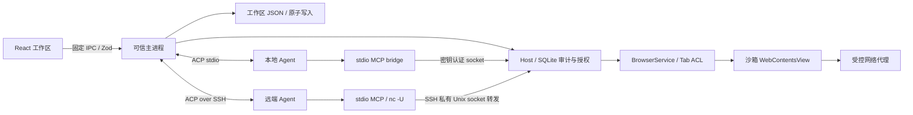

# Pilion 架构

Pilion 是桌面 ACP Client。浏览器属于用户，Agent 通过标准 MCP 工具操作当前授权的工作区。网页运行于独立的 Electron WebContentsView，React 只绘制可信浏览器界面。



## 模块

| 模块                                | 职责                                                             |
| ----------------------------------- | ---------------------------------------------------------------- |
| `shared/contracts.ts`               | IPC 与 Agent 配置验证、消息和工作区视图类型                      |
| `preload/entry.cts`                 | 沙箱 CommonJS preload，固定 IPC 白名单                           |
| `renderer/main.tsx`                 | 页面、标签、查找、缩放、下载和响应式布局                         |
| `renderer/ConversationPanel.tsx`    | 流式对话、Markdown、工具状态、接管、取消                         |
| `renderer/InlineApproval.tsx`       | Agent 面板内固定审批区域、详情与决策按钮                         |
| `main/agents/session-controls.ts`   | ACP 模型分组展开、旧版模型兼容和权限模式映射                     |
| `renderer/AgentSettings.tsx`        | 本地与 SSH 连接配置                                              |
| `main/workspace.ts`                 | 对话、Agent session、任务和浏览数据的原子持久化                  |
| `main/agents/transport.ts`          | ACP 生命周期、Goal/session 协商、脱敏 trace、进程回收            |
| `main/agents/ssh.ts`                | SSH 启动参数与远端 shell 参数转义                                |
| `shared/local-agents.ts`            | 八种本地 Agent 的固定预置目录、启动参数与认证环境变量            |
| `main/agents/local-agents.ts`       | Node.js 与 ACP 探测、nvm 路径解析、预置启动参数                  |
| `renderer/LocalAgentSettings.tsx`   | 预置 Agent、Node.js 路径、工作目录与连接状态                     |
| `main/agents/browser-mcp-server.ts` | 本地和远端共用的 MCP 工具定义                                    |
| `main/host`                         | Intent、审批、执行凭证、fencing、结果和审计                      |
| `main/browser`                      | 网页隔离、固定 CDP 命令、页面元素引用和网络策略                  |
| `main/recording`                    | 录制脚本、事件日志采集、纯投影、目标匹配、回放状态机、技能库目录 |
| `main/recording/distill.ts`         | 渲染过程时间线、提炼 prompt、取技能块、四条对账、编辑分权校验    |
| `renderer/SkillLibrary.tsx`         | 技能库：列表、步骤、轨迹、播放、改名、删除、编辑与提炼预览       |

## ACP 与远端连接

本地入口提供 Claude Code、Codex、Gemini CLI、Grok Build、OpenCode、Pi、Orca、Blade 八种预置。主进程探测可执行文件并规范化符号链接，不通过用户登录 shell 拼接命令。Node.js 程序和 npx 安装至少需要 Node 22，Pi 和 Blade 需要 22.19；原生程序无需 Node。通过扩展名及 shebang 检测 Node 脚本，兼容无扩展名的 Node 启动文件。旧版 `claude-code-acp` 作为 Claude 的兼容别名；缺少 npm 分发的适配器时使用固定包版本，通过选定 Node.js 执行 npx。Grok 缺失时不替换为名称相似的 npm 包。首次准备超时为三分钟，连接状态仍以 ACP 初始化和 session/new 完成为准。

Grok 使用 `agent --no-leader stdio` 创建独立会话进程；OpenCode 使用原生 `acp` 子命令。Pi 使用 `@automatalabs/pi-acp@0.6.3`，它通过 Pi SDK 承接宿主 MCP 工具，避免普通 `pi-acp` 只存储 `mcpServers` 而不转发的限制。全局 `pi-acp` 只有所属 npm 包确认为该实现才复用，否则走已固定版本的缓存或安装流程。

前端只能提交预置 ID、Node.js 路径和工作目录，包名和版本由主进程内置目录决定。Node.js 路径不合法时不会悄悄改用其它 Node。预置连接沿用 Agent 的本机登录，仅转发对应提供商的明确认证环境变量；不会批量复制其它环境密钥。

程序检测仅表示本机二进制存在，登录是否可用以实际握手为准。Gemini 使用其 `GEMINI_CLI_NO_RELAUNCH=1` 选项保持单一 stdio 所有者，避免重启包装器吞掉初始化消息。适配器的登录和服务端拒绝错误原样保留在连接错误中。npx 缓存只有包名和版本匹配内置版本时才复用。

ACP 会话顺序为 `initialize -> session/new -> session/prompt`；输出由 `session/update` 推送，取消使用 `session/cancel`。官方 SDK 管理协议，不自定义 agent 专用握手。ACP HTTP transport 目前仍是草案，因此远端使用 SSH 上的标准 stdio。

SSH 同时建立 ACP 标准输入输出通道，以及远端随机 Unix socket 到本机 MCP socket 的反向转发。远端 Agent 的 MCP 配置为 `nc -U /tmp/pilion-<uuid>.sock`，无需复制本机 Electron 路径或安装 Pilion。两端 socket 均限制为当前用户访问；连接结束销毁本机 MCP 监听和全部已接受连接。SSH 使用已有 known_hosts 与密钥认证，不自动信任未知主机，不使用密码弹窗。

同一时刻只有一个活跃 Agent 和一个 prompt。连接切换、创建会话、历史会话切换会拒绝与活跃任务交错。主进程持有真实连接 ID，界面不会把下拉框选择当成连接成功。连接失败、detach 和 lease 过期撤销浏览器权限。

停止任务会取消 ACP 请求并拒绝挂起审批；Agent 五秒内仍未结束时关闭连接。Prompt 总时限十分钟，超时使 transport 失败并回收进程，防止迟到输出混入下一任务。

## 输入框设置与审批

聊天交互使用 `@assistant-ui/react` 的 ExternalStoreRuntime。主进程发布的 ConversationMessage 通过 `renderer/chat-adapter.ts` 转为文本、reasoning 和 tool-call 消息部分；保留持久化 ID、时间和终止状态。`ThreadPrimitive.Viewport` 管理自动滚动和用户向上翻阅，`ThreadPrimitive.Messages` / `MessagePrimitive.Parts` 管理消息渲染，`ComposerPrimitive` 管理提交与停止。`renderer/ComposerInput.tsx` 用原生 textarea 对接 ComposerRuntime，组合输入期间由浏览器保留 marked text，提交选词后同步草稿；避免受控值回写打断中文输入法。权限/模型控件继续嵌入输入框，`InlineApproval` 固定在滚动区域之外。

每个会话拥有独立 runtime；收起面板时草稿保留于应用状态，并按会话 ID 隔离。消息和执行状态只接受主进程快照，不在前端重复插入用户消息或执行工具。只有主进程未接收任务时才用 MessageNotSentError 恢复草稿，已执行后失败的任务保留历史，不自动重发。复制回复仍走已有限定 IPC，Markdown 链接仍由受控浏览器打开。

聊天面板按需加载，不使用 Assistant Cloud。assistant-ui 采用 MIT 许可，依赖包保留其 LICENSE。

工作区默认 `permissionMode=full`（完全访问）：浏览器工具省略交互审批，继续走 Intent、执行凭证、页面引用校验与审计；ACP 权限请求返回提供的 allow 选项。连接时按 Agent 实际公布的选项同步完整访问模式，例如 Claude `bypassPermissions` 和 Codex `agent-full-access`，不会通过模糊字符串匹配误选只读模式。

用户可在输入框切换为 `ask`（操作前确认）。设置通过主进程验证和保存，活跃任务期间禁止切换。Agent 有权限模式时先等待远端设置成功，再更新本地权限状态；没有对应模式的 Agent 仍由 Pilion 决定是否自动回应其 ACP 权限请求，Agent 自身的其它执行限制由提供商控制。

模型优先读取 ACP `configOptions` 的 model 选项，支持分组，并通过 `session/set_config_option` 修改；旧适配器的 `models` 字段在有大小限制的 JSON-RPC 解码边界捕获，通过 `session/set_model` 修改。只允许选择实际列出的模型；只有成功响应或 Agent 通知才更新界面状态。

审批不创建 BrowserWindow。可信 Renderer 内的审批区固定在输入框上方，使用请求 ID、nonce、actionDigest 与短时 gesture token 回应。主进程校验 sender、frame、origin 和完整请求绑定，并在决策时重新核对页面 epoch/origin。过期、已完成及重放响应会拒绝。审批区独立于对话滚动区，长参数只在详情内部滚动。

## 对话和恢复

用户消息、Agent 消息、思考、工具和计划使用结构化记录。连续消息增量在主进程合并，不使用日志正则重建对话。工具 ID 按 turn 隔离。页面 snapshot 由固定 `Accessibility.getFullAXTree` 命令提取，返回 URL、标题、loading、最多六万字符的可见文字和独立 PNG screenshot；网页文本和截图都视作不可信数据。`browser.snapshot` 适合结构化决策，`browser.screenshot` 适合视觉确认，两者都经过当前 Tab ACL 和 Host 执行记录。

基础 ACP 路径中，每个用户发送动作只对应一次 `session/prompt`；Pilion 不补写、重放或隐藏续接 prompt。普通 Agent 返回空 `end_turn` 时记录 `AGENT_EMPTY_RESPONSE`，保留任务供用户显式继续。重复的 `tool_call` 按同一 turn 的 toolCallId 更新已有消息，不生成重复 ID，也不把已结束的工具重新标成执行中。

`workspace.json` 存储会话、Agent 返回的 ACP session ID、任务、书签、最近两百个页面和标签 URL，写入通过队列与临时文件 rename 串行化。重连时按能力优先调用 `session/resume`，其次调用 `session/load`；Agent 报告 session 不存在时才创建新 session。Pilion 不再把历史消息拼接进用户 prompt。

Agent 若在 `initialize._meta.goal` 声明 provider-neutral goal 扩展，任务由其 `controlMethod` 创建并由 Agent 自己持续执行。`session_info_update._meta.goal` 是任务状态的权威来源：`active` 保持运行，`complete` 或 `null` 完成任务，`paused` / `blocked` / `limited` 转为人工状态。当前 session 的异步 `session/update` 即使在 prompt/control 请求返回后仍会接收；只有用户取消后才丢弃迟到更新。未声明 goal 的 Agent 使用标准单回合 prompt。

Transport 保留最近两百条脱敏协议 trace，只记录方向、RPC ID、method、session update 类型和成功/错误结果，不记录用户 prompt、页面正文、工具参数、凭证或密钥。空响应错误附带该 trace，便于区分 Agent、适配器和 Host 路由问题。

## 原生视图

Agent 执行任务且 attachment 有效时，`browser/agent-shield.ts` 在网页上方显示无文案的原生半透明 WebContentsView 蒙层，阻挡人工鼠标、滚轮和键盘输入；原先聚焦的网页会失去键盘焦点。蒙层与网页区域同步缩放，位于网页之上、可见 Agent 鼠标之下，不覆盖聊天、审批和底部停止/接管按钮。主进程将同一个 `agentActivityPhase` 同步给蒙层视觉相位和底部控制条，底部控制条是“思考 / 操作页面 / 等待确认”状态文案的唯一入口。Agent 的 CDP 指令直接作用于底层网页。完成、报错、停止或接管时移除蒙层；接管会撤销 attachment，再恢复人工操作。蒙层使用独立沙箱文档，没有 preload 或 IPC 权限，也不会出现在 Agent 的网页截图内。

Agent 的可见鼠标由 `browser/agent-pointer.ts` 创建透明、不可聚焦、鼠标穿透的原生子窗口，位于网页 WebContentsView 上方。执行 click/type/select/check/press 前将目标滚入视口，重新读取坐标，以短轨迹同时更新 CDP mouseMoved 和可见光标；点击使用相同位置并播放波纹。坐标按页面缩放与窗口位置换算。系统开启「减少动态效果」时不做轨迹动画，但光标仍在目标上停留 240 毫秒再操作，保留人工接管的窗口。移动后重新验证目标指纹、位置和遮挡，目标变化时拒绝继续。切换标签、导航、停止和接管会清理光标并取消进行中的指针操作；窗口失焦、缩放、最小化或隐藏只收起光标，不打断 Agent 正在进行的输入；操作完成短暂展示后自动隐藏。

任何 Agent 都可以调用 `browser.request_human` 主动交还浏览器并说明原因，不必等人发现它卡住。该工具不经过页面动作路径，直接把任务转入人工状态并保留现场；goal 型 Agent 上报 `paused`/`blocked`/`limited` 走同一段逻辑。人工状态期间的标签页导航会记入任务的 handover，继续任务时作为一句交接说明随 prompt 发给 Agent，避免它基于过期认知继续操作。输入框上方同时提示补充说明可跳过。

接管和停止都会取消当前 ACP prompt、清除 Agent goal、忽略迟到消息、撤销 attachment，并清理在途操作、审批、蒙层和光标。`agents.takeOver` 将会话任务标记为 `manual`，保留目标与进度并显示“继续任务”；`agents.cancel` 将任务标记为 `stopped`，不再提供继续入口。取消响应前禁止重新启动，五秒无响应则关闭 Agent 连接。任务目标、Agent ID、ACP session ID 和状态随会话持久化；重启后仍在执行的任务进入人工状态。

`agents.resume` 必要时重新连接原 Agent，并恢复持久化 ACP session。Goal Agent 重新设置原目标和用户补充；普通 Agent 发送一次显式“继续任务”消息。人工状态下发送聊天内容作为补充说明并继续；停止后的消息开启新任务。浏览器底部始终直接显示停止任务：执行中与接管并排，人工状态下与继续任务并排；停止使用次按钮，接管和继续使用主按钮。聊天输入框保留停止按钮。

原生 select 使用固定、仅针对已验证选项的 DOM 函数触发 input/change 事件，避免 macOS 弹出菜单按键行为差异；不接受 Agent 传入脚本。100% / 125% 缩放下的真实移动、点击、表单值和接管均有 Electron E2E 覆盖。

Renderer 通过 ResizeObserver 把网页区域尺寸提交给主进程，主进程把边界限制在窗口内。设置、历史、下载、新标签页和窄屏覆盖层会隐藏 WebContentsView，避免原生网页遮挡可信控件。查找栏和浏览工具栏进入正常布局流，展开时同步缩小原生网页视口。网页没有 preload 和 Node 权限；唯一例外是录制期间，Pilion 自带的固定脚本运行在页面看不到的隔离世界里，只读事件、不改页面；停止录制会摘掉 binding 并撤掉新文档注入，当前文档里已经注入的那份脚本随之失效（它的 binding 已经没了，发不出任何东西），下一个文档不再注入。网页链接的新窗口请求交给主进程验证后创建标签页；地址栏输入与导航仍经过统一 URL 策略。

页内查找、停止加载和缩放只作用于当前可信 `tabId` 对应的 `WebContents`。最近关闭标签保存在本次应用会话中，恢复时仍重新经过统一 URL 策略。下载由持久分区的 `will-download` 事件接管，使用冲突安全的文件名写入系统下载目录；工作区只持久化最多一百条下载元数据。Renderer 只能提交下载记录 ID，主进程在打开或定位文件前重新校验记录路径位于下载目录。

## 录制与技能

人可以录制自己在当前标签上的操作，得到一份行为轨迹；轨迹是 `recordings/<slug>/trajectory.md` 里的一个 ```json pilion-trajectory 代码块，上方的时间线由它渲染、加载时忽略，这个代码块的 `entries` 是从同目录 `events.jsonl` 算出来的投影，不是独立写入的另一份真相。每次写入都先写进随机命名的临时文件、再 rename 到位，两次写入不会撞上同一个 `.tmp`；这个应用没有单实例锁，两个实例可能同时各写各的录制目录，进程崩溃在写完与 rename 之间留下的临时文件不会被后续写入自动覆盖，所以启动时会清扫一次——只删每份录制目录下修改时间早于十分钟的 `.tmp`，新鲜的不碰，失败只记日志，不阻断启动。步骤只有 `navigate / click / type / select / check / press / human / note` 八种，目标用角色、可访问名、标签、输入类型、同名序号与指纹前缀描述，不含任何只有 Pilion 认得的句柄；`ElementRef` 不落盘，因为它的三层身份（标签、文档 epoch、CDP nodeId）都是一次性的。轨迹文件是 `0o600` 的明文，里面没有密码也没有一次性验证码（那两类字段只留「需要我」步骤；封闭影子根、隔了一层的 `aria-owns` 这两种元素名形状是例外，见本段后文），但确实有你键入的文本（邮箱、搜索词等）、页面标题和正文摘录，所以它和浏览记录一样敏感。`events.jsonl` 是这份投影算出来的依据：只增不改的原始事件流，停止录制时一次性写入，权限同样是 `0o600`，同样没有密码和一次性验证码（页面脚本源头就过滤掉，不带值也不带长度；那两种元素名形状同样是例外），但同样有键入的文本、页面标题与正文摘录，敏感度与轨迹文件相同，比它更细——记的是每一次改动而不只是最终值。富文本编辑本身只记字符数、不记内容；编辑区里的正文、密码框与一次性验证码框的值也不经元素名落盘，已知的例外是封闭影子根、只靠 CSS 变成可编辑的区域，以及隔了一层的 `aria-owns`（见下）。一个元素的名字可能取自这些地方时——自己身处编辑区（自己或祖先是编辑宿主，即 `contenteditable` 且不为 `false`，所以编辑区里的链接、`contenteditable="false"` 的提及标签都算；沿扁平树跨过开放影子根与插槽去找；文档开着 `designMode` 时处处都算），子树里有编辑宿主或密码、验证码框（开放影子根里的也算），或者 `aria-labelledby`、`aria-owns`、`label` 指向这样的元素（`aria-labelledby` 连自己也算进去的密码、验证码框也算：浏览器取名时会读进它自己的值）——页面脚本算名字会跳过编辑宿主和分配进编辑区插槽的内容，身处编辑区的元素完全不从内容取名，并在元素描述上标 `editable`。WAI-ARIA 1.2 里只有按钮、链接、单元格、标题、选项卡这类十八种角色从内容取名，其余角色（表单、对话框、分组、应用等）带标记时也不从内容取名，只认作者给的标签，干净名因此一般与可访问性树的名字一致：没有名字的登录表单、登录弹窗两边都是空串（Chromium 有少数角色与规范不同，比如 `math`、`term` 照样从内容取名，网格之外的 `row` 却不取，这些对不上就扣下）。其余元素照旧直接读 `textContent`，载荷与以前逐字节相同。进开放影子根要逐个元素看，只给正在描述的那个元素做，同名计数那一圈不做。observe 的名字来自浏览器的可访问性树，按钮、链接、单元格这类角色取的是内部文字，编辑区里的正文、密码框的圆点（个数就是密码的长度）、验证码本身都算在内，所以采集层只在 observe 那一行的名字与脚本的干净名规范化后相等时才用它（带标签、不带标签的编辑框都是这样，回放照常按名字匹配），名字不空时还要个数对得上：脚本按干净名数出的同名个数，得等于 observe 里同角色、同标签、同名的行数。否则一律扣下名字：目标只取脚本自己的描述，`name` 为空串、带 `editable: true`，不带 `nth`，也不带指纹，时间线、步骤视图与审批摘要里写作「[名称已隐去，含富文本]」。扣下名字的步骤回放时既不按名字也不按指纹匹配：空名或残缺的名字可能正好等于页面上另一个元素的名字；指纹也只有名字能证明 observe 那一行就是它时才可信。observe 是换页时预取的，之后插进页面的元素会让序号错位，比如在旧卡片前面新建一张同标题的卡片，序号上那一行就成了旧卡片；以前是正文把它挡在外面，名字扣下后就没有东西挡了。个数那道关拦的也是这种错位：旧卡片那一行若是在它的编辑区还空着时取的名，正好等于新卡片的干净名，名字相等，但页面上同名的卡片比 observe 里多一张；它只拦得住让个数变了的错位。名字为空的元素不比个数（没带标记的表单这类元素，脚本从内容取名，可访问性树里却是空串，两边的个数本就对不上），照旧是以前的做法：序号上同标签、同角色、名字也为空的那一行就算对上，observe 过期时可能对到另一个元素上，与改动前一样。这是回放能力上的取舍：包着编辑区的元素，以前要编辑区里的字与录制时完全相同才能按名字回放；现在回放到名字被扣下的步骤会停在这一步并报告是哪一步，由 Agent 发起的回放则把这一步交还给 Agent。带标记的元素若有同名的另一个，页面什么都没变也可能被个数那道关扣下，回放同样停在这一步：比如同标题的另一张卡片编辑区里已经有字，或者同名的那个排在 observe 只看的前 200 个元素之后；这样只是多停一步，不会点错。封闭影子根（`mode: 'closed'`）页面脚本看不进去，只靠 CSS `-webkit-user-modify` 变成可编辑、没写 `contenteditable` 的区域脚本也认不出，`aria-owns` 也只认元素自己身上的那一个：子树里的元素、标签来源或被拥有的元素再用 `aria-owns` 挂进来的编辑区、密码框，可访问性树照样算进名字，脚本却看不到。这三种形状里的字（封闭影子根与 `aria-owns` 那两种还有密码框的圆点与验证码）仍可能经元素名进入日志与轨迹。页面条目另有一段正文摘录，不归元素名管：开始录制时与每次换页（包括页内地址变化）时，记下页面最前面 2000 字。它取自可访问性树里的文字，而浏览器把输入框的值作为文字挂在框下面（验证码原样，密码是一串个数等于长度的圆点；后退回到一页时浏览器还会把验证码框的值填回去），编辑区里的字也一样。所以录制不用 Agent 读页面的 `readText`，改用页面适配器专门给录制的 `readRecordableText`（`browser/recordable-text.ts`）：取的节点与顺序照旧，只跳过人能往里打字的地方——一段字自己或某个祖先带 `editable` 属性，或是 `textbox`、`searchbox`、`spinbutton` 角色，就不要；子树里有这类节点、或名字取自 `aria-labelledby` 的标题整条不要，因为标题的名字会把嵌在里面或被指向的输入框的值算进去。于是输入框、文本域、数字框、可编辑组合框和富文本编辑区里的字，不论是不是密码与验证码，都不进摘录；可访问性树看得见封闭影子根和只靠 CSS 变成可编辑的区域，这两种在摘录里同样跳过。代价是页面上已有的编辑区内容（比如草稿）不再出现在提炼时的页面上下文里。页面自己把打的字另写成普通文字的（编辑区旁的实时预览、「……的搜索结果」、把每一位画进普通元素而不放进输入框的验证码组件），摘录认不出来。Agent 自己读页面（`browser.snapshot`、`browser.page_info`）仍用 `readText`，看到的与以前相同。

录制只能由人从可信 Renderer 开启，MCP 里没有这个动词。录制期间，`browser/recording-channel.ts` 用固定 CDP 命令把 Pilion 自带的脚本放进名为 `pilion-recorder` 的隔离世界（`Page.createIsolatedWorld` 与 `Page.addScriptToEvaluateOnNewDocument`），通过随机命名的 `Runtime.addBinding` 回传。停止录制会同步摘掉 `Runtime.bindingCalled` 监听、移除 binding 与新文档注入，所以队列排空之后不会再有事件进来；当前文档里已经注入的那份脚本失去 binding 后也发不出任何东西。脚本只收 `isTrusted` 事件、只描述元素、永不 `preventDefault`、永不等主进程；密码与一次性验证码字段只产出「需要我」步骤，脚本不发它们的值与长度（页面正文摘录另走一条路，同样不带它们，见上）。事件先进 `recording/capture.ts`：有副作用的一层，持有时钟，用当前 `observe()` 结果解析目标，写成 `events.jsonl` 里的一行。归一化（连续输入合并、mousedown 即跳转合成点击、双击折叠、超纲标记）在下一层 `recording/project.ts` 完成：纯函数，没有时钟、没有 I/O，把事件流算成 `trajectory.md` 的步骤，同一份日志重算多少次结果都一样。每个文档加载完成时主进程预取一次 `observe()`，步骤的角色与名字从它那一行取，和回放走同一条 AX 路径。

因为 `Input.dispatchMouseEvent` 派发的事件 `isTrusted` 也为 true，录制、回放与 Agent 任务在主进程里互斥：录制期间所有浏览器工具直接拒绝，发任务被拒并说明原因。切标签、关标签、页面崩溃与退出都会先停止并保存。录制中界面显示红点、实时步数与由可信 Renderer 画的红框；红框不进页面，因此不会出现在截图里。

回放不新增元素身份通道：`recording/player.ts` 只是主进程里的一个 `ToolRequest` 调用方，每步 `browser.observe` → `resolve()` → `browser.click` 等，与 Agent 走同一条 `runTool` 路径，因此 Intent 台账、指纹重校验、epoch fencing、蒙层与取消链路全部沿用。`resolve()` 按指纹前缀、精确、归一化名字、同名序号、select 选项交集五级降级，每级要求唯一命中，全部落空就停下并交出现场。人工回放以 `local-user` 的 Host session 与 attachment 执行，台账里与 Agent 分得开；`human` 步骤把回放转为暂停，人完成后点继续从下一步续播。

Agent 在一个专属对话里把轨迹提炼成 `skill.md`：那一轮没有浏览器工具，主进程从回合文本里取出 ```json pilion-skill 块并按四条规则与轨迹逐步对账 —— 每个动作步必须消耗一条同类型同目标的轨迹步、值不能改写（可用 `{{占位符}}` 隐去）、导航地址必须去过、只有 `human` 与 `note` 可以自由插入。人按保留才落盘；界面只能删、排、改值、插「需要我」，主进程再次校验，不能新建动作步骤。

`browser.skills.list` 只列已提炼的技能；`browser.skills.play` 走与其它工具相同的 Intent 路径，同一任务内首次回放某技能需人一次审批（`full` 模式也问），审批摘要列出全部步骤、digest 覆盖步骤哈希。之后每一步仍以 Agent 的 attachment 记账并附 `replay.step` 事件。目标解析失败时工具返回失败现场，Agent 只修那一步再以 `fromStep` 续播；遇到「需要我」或占位符则任务转人工，人继续时交接说明里注明从第几步续播。

## 当前边界

- 一个个人工作区、一个活跃 Agent；没有并行多 Agent 调度。
- SSH 远端要求 Unix、OpenSSH Unix socket forwarding 和支持 `-U` 的 netcat；Windows SSH 主机未支持。
- 可从本机 Chrome 一键导入全部 cookie，只支持 macOS：密钥取自钥匙串的 Chrome Safe Storage，数据库先复制再只读打开，因此 Chrome 运行时也能导。渲染层只能提交一个 Chrome 配置文件名，且必须命中主进程枚举出的列表，拿不到任意路径。导入前有明确的确认条，导入后按会话实际存量报数。这会把全部登录态放进 Agent 可驾驶的工作区，是刻意的取舍。
- 页面网络默认拒绝私网、loopback、metadata、证书错误和权限请求。当前没有局域网网站例外设置。WebRTC 被限制为不允许非代理 UDP，避免绕开受控代理。
- 域名解析到 198.18.0.0/15 时按代理 fake-IP 处理并放行，URL 中直接写该段地址仍然拒绝。Clash、sing-box、Shadowrocket 的 fake-IP 模式默认使用这一段，否则所有网页都无法打开。该段被真实路由的网络上，恶意 DNS 应答可借此触达，这是已知取舍。
- 下载记录不提供危险文件扫描、来源信誉判断或跨设备同步；文件绝不会在下载完成后自动打开。
- 未声明 ACP 文件系统/终端能力；Agent 自己执行的本机/远端文件命令遵循该 Agent 的权限体系，Pilion 的浏览器授权并不构成 Agent 进程沙箱。
- 不包含密码管理、扩展商店或跨设备同步；安装包在配置签名证书前未签名。
- Markdown 不渲染原始 HTML，外链通过受控浏览器打开。复制只允许指定当前对话中已有消息 ID，不开放任意剪贴板读取接口。

## 验证

`pnpm test` 覆盖策略、原子存储、帧校验、MCP、SSH 引号转义与真实 Unix socket MCP 回程。`pnpm test:e2e` 在隔离 profile 启动真实 Electron，验证浏览、主进程 IPC、审批、正文、对话、取消与恢复。`pnpm test` 另覆盖事件日志 schema 与 `v1`/`v2` 轨迹格式往返、目标匹配五级降级、录制脚本的 isTrusted、密码过滤、滚动节流与 iframe 收口、采集层的上限与目标解析、编辑上下文里的元素取名跳过编辑区（含开放影子根、插槽与 designMode）且普通元素载荷逐字节不变、包着、拥有或被指向密码与验证码框的元素（含 `aria-labelledby` 连自己也算进去的密码、验证码框）同样带标记、只按作者标签取名的角色带标记时不从内容取名（没有名字的登录表单与登录弹窗回放照常）、名字证明不了干净或同名个数与 observe 对不上就扣下且不带指纹、扣下名字的目标回放一律停在那一步（包括同标题新卡片让序号错位的两种卡片）、投影层的纯函数性质（同一份日志算两次结果相同）、日志与轨迹哈希不符时的重算、渲染给 Agent 的过程时间线折叠规则、录制会话与提炼生命周期编排、录制通道的命令顺序与回放状态机、录制摘录跳过输入框、文本域、编辑区（含编辑区里不可编辑的提及标签与嵌入块）、不带 `editable` 的文本输入类角色，以及名字取了它们的字或取自 `aria-labelledby` 的标题，除此之外与 Agent 用的 `readText` 取同样的节点、同样的顺序，页面条目只经这个方法取摘录；`pnpm test:e2e` 覆盖真实录制一次点击、保存、不连 Agent 回放到目标页、目标消失时回放停在正确的步骤，以及录制中的滚动、后退与富文本输入进了事件日志——后退在步骤视图里是一条 navigate，技能库「过程」视图能看到折叠后的滚动次数与停顿；另有一条在带角色属性的外壳里的编辑区打字、页内地址变化让主进程重新观察之后再点一下，读 `events.jsonl` 与 `trajectory.md` 全文，确认打的字没有经页面脚本或可访问性树的元素名出现一次，同页一个普通按钮带着指纹，证明点卡片时 observe 是活的；还有一条在验证码框、密码框与没有角色属性的编辑区里打字，单页应用在同一份文档里改一次地址，读两份文件全文，确认验证码、个数等于密码长度的圆点与编辑区里的句子一次也不出现，页面上的普通文字仍在那条页面条目的摘录里。测试 Agent 是确定性 ACP fixture，不代表生产模型质量或真实远端主机已经认证成功。

2026-09-07 在隔离 Electron profile 中通过本机 Claude Code 的 ACP 适配器完成真实模型验收：从 `about:blank` 列出标签页，导航至 `https://example.com/`，读取正文，observe 后点击 Learn more，再读取 `https://www.iana.org/help/example-domains`。另从 Electron WebContents 独立核对了最终 URL、标题和正文。验收修复了空白页来源无法生成执行记录，以及 `192.0.43.8` 被误判为私网的问题；对应的确定性 E2E 断言实际链接跳转。此记录只覆盖这条本地浏览链路，不代表所有 Agent、远端 SSH 或复杂网站任务均已验收。

Claude Agent 当前声明 provider-neutral goal 扩展，Pilion 使用该能力承载长期浏览任务，不再用隐藏 prompt 补偿空 `end_turn`。确定性 E2E 覆盖 goal 控制请求返回后继续接收异步 MCP 操作与输出，直到 Agent 发布 goal 完成状态。

协议参考：https://agentclientprotocol.com/protocol/transports
OpenCode ACP：https://opencode.ai/docs/acp/
Pi 适配器：https://github.com/agentprism/agentprism-workflows/tree/main/packages/pi-acp
新标签页照片：https://images.unsplash.com/photo-1470770841072-f978cf4d019e
