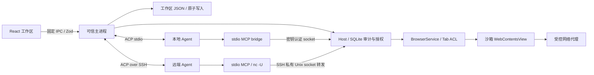

# Pilion 架构

Pilion 是桌面 ACP Client。浏览器属于用户，Agent 通过标准 MCP 工具操作当前授权的工作区。网页运行于独立的 Electron WebContentsView，React 只绘制可信浏览器界面。

## 模块

| 模块                                | 职责                                                  |
| ----------------------------------- | ----------------------------------------------------- |
| `shared/contracts.ts`               | IPC 与 Agent 配置验证、消息和工作区视图类型           |
| `preload/entry.cts`                 | 沙箱 CommonJS preload，固定 IPC 白名单                |
| `renderer/main.tsx`                 | 页面、标签、查找、缩放、下载和响应式布局              |
| `renderer/ConversationPanel.tsx`    | 流式对话、Markdown、工具状态、接管、取消              |
| `renderer/InlineApproval.tsx`       | Agent 面板内固定审批区域、详情与决策按钮              |
| `main/agents/session-controls.ts`   | ACP 模型分组展开、旧版模型兼容和权限模式映射          |
| `renderer/AgentSettings.tsx`        | 本地与 SSH 连接配置                                   |
| `main/workspace.ts`                 | 对话、Agent session、任务和浏览数据的原子持久化       |
| `main/agents/transport.ts`          | ACP 生命周期、Goal/session 协商、脱敏 trace、进程回收 |
| `main/agents/ssh.ts`                | SSH 启动参数与远端 shell 参数转义                     |
| `shared/local-agents.ts`            | 六种本地 Agent 的固定预置目录、启动参数与认证环境变量 |
| `main/agents/local-agents.ts`       | Node.js 与 ACP 探测、nvm 路径解析、预置启动参数       |
| `renderer/LocalAgentSettings.tsx`   | 预置 Agent、Node.js 路径、工作目录与连接状态          |
| `main/agents/browser-mcp-server.ts` | 本地和远端共用的 MCP 工具定义                         |
| `main/host`                         | Intent、审批、执行凭证、fencing、结果和审计           |
| `main/browser`                      | 网页隔离、固定 CDP 命令、页面元素引用和网络策略       |

## ACP 与远端连接

本地入口提供 Claude Code、Codex、Gemini CLI、Grok Build、OpenCode、Pi 六种预置。主进程探测可执行文件并规范化符号链接，不通过用户登录 shell 拼接命令。Node.js 程序和 npx 安装至少需要 Node 22，Pi 需要 22.19；原生程序无需 Node。通过扩展名及 shebang 检测 Node 脚本，兼容无扩展名的 Node 启动文件。旧版 `claude-code-acp` 作为 Claude 的兼容别名；缺少 npm 分发的适配器时使用固定包版本，通过选定 Node.js 执行 npx。Grok 缺失时不替换为名称相似的 npm 包。首次准备超时为三分钟，连接状态仍以 ACP 初始化和 session/new 完成为准。

Grok 使用 `agent --no-leader stdio` 创建独立会话进程；OpenCode 使用原生 `acp` 子命令。Pi 使用 `@automatalabs/pi-acp@0.6.3`，它通过 Pi SDK 承接宿主 MCP 工具，避免普通 `pi-acp` 只存储 `mcpServers` 而不转发的限制。全局 `pi-acp` 只有所属 npm 包确认为该实现才复用，否则走已固定版本的缓存或安装流程。

前端只能提交预置 ID、Node.js 路径和工作目录，包名和版本由主进程内置目录决定。Node.js 路径不合法时不会悄悄改用其它 Node。预置连接沿用 Agent 的本机登录，仅转发对应提供商的明确认证环境变量；不会批量复制其它环境密钥。

程序检测仅表示本机二进制存在，登录是否可用以实际握手为准。Gemini 使用其 `GEMINI_CLI_NO_RELAUNCH=1` 选项保持单一 stdio 所有者，避免重启包装器吞掉初始化消息。适配器的登录和服务端拒绝错误原样保留在连接错误中。npx 缓存只有包名和版本匹配内置版本时才复用。

ACP 会话顺序为 `initialize -> session/new -> session/prompt`；输出由 `session/update` 推送，取消使用 `session/cancel`。官方 SDK 管理协议，不自定义 agent 专用握手。ACP HTTP transport 目前仍是草案，因此远端使用 SSH 上的标准 stdio。

SSH 同时建立 ACP 标准输入输出通道，以及远端随机 Unix socket 到本机 MCP socket 的反向转发。远端 Agent 的 MCP 配置为 `nc -U /tmp/pilion-<uuid>.sock`，无需复制本机 Electron 路径或安装 Pilion。两端 socket 均限制为当前用户访问；连接结束销毁本机 MCP 监听和全部已接受连接。SSH 使用已有 known_hosts 与密钥认证，不自动信任未知主机，不使用密码弹窗。

同一时刻只有一个活跃 Agent 和一个 prompt。连接切换、创建会话、历史会话切换会拒绝与活跃任务交错。主进程持有真实连接 ID，界面不会把下拉框选择当成连接成功。连接失败、detach 和 lease 过期撤销浏览器权限。

停止任务会取消 ACP 请求并拒绝挂起审批；Agent 五秒内仍未结束时关闭连接。Prompt 总时限十分钟，超时使 transport 失败并回收进程，防止迟到输出混入下一任务。

## 输入框设置与审批

聊天交互使用 `@assistant-ui/react` 的 ExternalStoreRuntime。主进程发布的 ConversationMessage 通过 `renderer/chat-adapter.ts` 转为文本、reasoning 和 tool-call 消息部分；保留持久化 ID、时间和终止状态。`ThreadPrimitive.Viewport` 管理自动滚动和用户向上翻阅，`ThreadPrimitive.Messages` / `MessagePrimitive.Parts` 管理消息渲染，`ComposerPrimitive` 管理提交与停止。`renderer/ComposerInput.tsx` 用原生 textarea 对接 ComposerRuntime，组合输入期间由浏览器保留 marked text，提交选词后同步草稿；避免受控值回写打断中文输入法。权限/模型控件继续嵌入输入框，`InlineApproval` 固定在滚动区域之外。

每个会话拥有独立 runtime；收起面板时草稿保留于应用状态，并按会话 ID 隔离。消息和执行状态只接受主进程快照，不在前端重复插入用户消息或执行工具。只有主进程未接收任务时才用 MessageNotSentError 恢复草稿，已执行后失败的任务保留历史，不自动重发。复制回复仍走已有限定 IPC，Markdown 链接仍由受控浏览器打开。

聊天面板按需加载，不使用 Assistant Cloud。assistant-ui 采用 MIT 许可，依赖包保留其 LICENSE；Obsidian Agent Client 仅作为 ACP 交互设计参考，本次未复制其代码。

工作区默认 `permissionMode=full`（完全访问）：浏览器工具省略交互审批，继续走 Intent、执行凭证、页面引用校验与审计；ACP 权限请求返回提供的 allow 选项。连接时按 Agent 实际公布的选项同步完整访问模式，例如 Claude `bypassPermissions` 和 Codex `agent-full-access`，不会通过模糊字符串匹配误选只读模式。

用户可在输入框切换为 `ask`（操作前确认）。设置通过主进程验证和保存，活跃任务期间禁止切换。Agent 有权限模式时先等待远端设置成功，再更新本地权限状态；没有对应模式的 Agent 仍由 Pilion 决定是否自动回应其 ACP 权限请求，Agent 自身的其它执行限制由提供商控制。

模型优先读取 ACP `configOptions` 的 model 选项，支持分组，并通过 `session/set_config_option` 修改；旧适配器的 `models` 字段在有大小限制的 JSON-RPC 解码边界捕获，通过 `session/set_model` 修改。只允许选择实际列出的模型；只有成功响应或 Agent 通知才更新界面状态。

审批不创建 BrowserWindow。可信 Renderer 内的审批区固定在输入框上方，使用请求 ID、nonce、actionDigest 与短时 gesture token 回应。主进程校验 sender、frame、origin 和完整请求绑定，并在决策时重新核对页面 epoch/origin。过期、已完成及重放响应会拒绝。审批区独立于对话滚动区，长参数只在详情内部滚动。

## 对话和恢复

用户消息、Agent 消息、思考、工具和计划使用结构化记录。连续消息增量在主进程合并，不使用日志正则重建对话。工具 ID 按 turn 隔离。页面 snapshot 由固定 `Accessibility.getFullAXTree` 命令提取，返回 URL、标题、loading、最多六万字符的可见文字和独立 PNG screenshot；网页文本和截图都视作不可信数据。`browser.snapshot` 适合结构化决策，`browser.screenshot` 适合视觉确认，两者都经过当前 Tab ACL 和 Host 执行记录。

基础 ACP 路径中，每个用户发送动作只对应一次 `session/prompt`；Pilion 不补写、重放或隐藏续接 prompt。普通 Agent 返回空 `end_turn` 时记录 `AGENT_EMPTY_RESPONSE`，保留任务供用户显式继续。重复的 `tool_call` 按同一 turn 的 toolCallId 更新已有消息，不生成重复 ID，也不把已结束的工具重新标成执行中。

`workspace.json` 存储会话、Agent 返回的 ACP session ID、任务、书签、最近两百个页面和标签 URL，写入通过队列与临时文件 rename 串行化。重连时按能力优先调用 `session/resume`，其次调用 `session/load`；Agent 报告 session 不存在时才创建新 session。Pilion 不再把历史消息拼接进用户 prompt。

Agent 若在 `initialize._meta.goal` 声明 provider-neutral goal 扩展，任务由其 `controlMethod` 创建并由 Agent 自己持续执行。`session_info_update._meta.goal` 是任务状态的权威来源：`active` 保持运行，`complete` 或 `null` 完成任务，`paused` / `blocked` / `limited` 转为人工状态。当前 session 的异步 `session/update` 即使在 prompt/control 请求返回后仍会接收；只有用户取消后才丢弃迟到更新。未声明 goal 的 Agent 使用标准单回合 prompt。

Transport 保留最近两百条脱敏协议 trace，只记录方向、RPC ID、method、session update 类型和成功/错误结果，不记录用户 prompt、页面正文、工具参数、凭证或密钥。空响应错误附带该 trace，便于区分 Agent、适配器和 Host 路由问题。

## 原生视图

Agent 执行任务且 attachment 有效时，`browser/agent-shield.ts` 在网页上方显示无文案的原生半透明 WebContentsView 蒙层，阻挡人工鼠标、滚轮和键盘输入；原先聚焦的网页会失去键盘焦点。蒙层与网页区域同步缩放，位于网页之上、可见 Agent 鼠标之下，不覆盖聊天、审批和底部停止/接管按钮。主进程将同一个 `agentActivityPhase` 同步给蒙层视觉相位和底部控制条，底部控制条是“思考 / 操作页面 / 等待确认”状态文案的唯一入口。Agent 的 CDP 指令直接作用于底层网页。完成、报错、停止或接管时移除蒙层；接管会撤销 attachment，再恢复人工操作。蒙层使用独立沙箱文档，没有 preload 或 IPC 权限，也不会出现在 Agent 的网页截图内。

Agent 的可见鼠标由 `browser/agent-pointer.ts` 创建透明、不可聚焦、鼠标穿透的原生子窗口，位于网页 WebContentsView 上方。执行 click/type/select/check/press 前将目标滚入视口，重新读取坐标，以短轨迹同时更新 CDP mouseMoved 和可见光标；点击使用相同位置并播放波纹。坐标按页面缩放与窗口位置换算。移动后重新验证目标指纹、位置和遮挡，目标变化时拒绝继续。切换标签、导航、窗口隐藏、停止和接管会清理光标；操作完成短暂展示后自动隐藏。

接管和停止都会取消当前 ACP prompt、清除 Agent goal、忽略迟到消息、撤销 attachment，并清理在途操作、审批、蒙层和光标。`agents.takeOver` 将会话任务标记为 `manual`，保留目标与进度并显示“继续任务”；`agents.cancel` 将任务标记为 `stopped`，不再提供继续入口。取消响应前禁止重新启动，五秒无响应则关闭 Agent 连接。任务目标、Agent ID、ACP session ID 和状态随会话持久化；重启后仍在执行的任务进入人工状态。

`agents.resume` 必要时重新连接原 Agent，并恢复持久化 ACP session。Goal Agent 重新设置原目标和用户补充；普通 Agent 发送一次显式“继续任务”消息。人工状态下发送聊天内容作为补充说明并继续；停止后的消息开启新任务。浏览器底部始终直接显示停止任务：执行中与接管并排，人工状态下与继续任务并排；停止使用次按钮，接管和继续使用主按钮。聊天输入框保留停止按钮。

原生 select 使用固定、仅针对已验证选项的 DOM 函数触发 input/change 事件，避免 macOS 弹出菜单按键行为差异；不接受 Agent 传入脚本。100% / 125% 缩放下的真实移动、点击、表单值和接管均有 Electron E2E 覆盖。

Renderer 通过 ResizeObserver 把网页区域尺寸提交给主进程，主进程把边界限制在窗口内。设置、历史、下载、新标签页和窄屏覆盖层会隐藏 WebContentsView，避免原生网页遮挡可信控件。查找栏和浏览工具栏进入正常布局流，展开时同步缩小原生网页视口。网页没有 preload 和 Node 权限。网页链接的新窗口请求交给主进程验证后创建标签页；地址栏输入与导航仍经过统一 URL 策略。

页内查找、停止加载和缩放只作用于当前可信 `tabId` 对应的 `WebContents`。最近关闭标签保存在本次应用会话中，恢复时仍重新经过统一 URL 策略。下载由持久分区的 `will-download` 事件接管，使用冲突安全的文件名写入系统下载目录；工作区只持久化最多一百条下载元数据。Renderer 只能提交下载记录 ID，主进程在打开或定位文件前重新校验记录路径位于下载目录。

## 当前边界

- 一个个人工作区、一个活跃 Agent；没有并行多 Agent 调度。
- SSH 远端要求 Unix、OpenSSH Unix socket forwarding 和支持 `-U` 的 netcat；Windows SSH 主机未支持。
- 页面网络默认拒绝私网、loopback、metadata、证书错误和权限请求。当前没有局域网网站例外设置。
- 下载记录不提供危险文件扫描、来源信誉判断或跨设备同步；文件绝不会在下载完成后自动打开。
- 未声明 ACP 文件系统/终端能力；Agent 自己执行的本机/远端文件命令遵循该 Agent 的权限体系，Pilion 的浏览器授权并不构成 Agent 进程沙箱。
- 不包含密码管理、扩展商店、下载管理器、跨设备同步或安装包签名。
- Markdown 不渲染原始 HTML，外链通过受控浏览器打开。复制只允许指定当前对话中已有消息 ID，不开放任意剪贴板读取接口。

## 验证

`pnpm test` 覆盖策略、原子存储、帧校验、MCP、SSH 引号转义与真实 Unix socket MCP 回程。`pnpm test:e2e` 在隔离 profile 启动真实 Electron，验证浏览、主进程 IPC、审批、正文、对话、取消与恢复。测试 Agent 是确定性 ACP fixture，不代表生产模型质量或真实远端主机已经认证成功。

2026-09-07 在隔离 Electron profile 中通过本机 Claude Code 的 ACP 适配器完成真实模型验收：从 `about:blank` 列出标签页，导航至 `https://example.com/`，读取正文，observe 后点击 Learn more，再读取 `https://www.iana.org/help/example-domains`。另从 Electron WebContents 独立核对了最终 URL、标题和正文。验收修复了空白页来源无法生成执行记录，以及 `192.0.43.8` 被误判为私网的问题；对应的确定性 E2E 断言实际链接跳转。此记录只覆盖这条本地浏览链路，不代表所有 Agent、远端 SSH 或复杂网站任务均已验收。

Claude Agent 当前声明 provider-neutral goal 扩展，Pilion 使用该能力承载长期浏览任务，不再用隐藏 prompt 补偿空 `end_turn`。确定性 E2E 覆盖 goal 控制请求返回后继续接收异步 MCP 操作与输出，直到 Agent 发布 goal 完成状态。

协议参考：https://agentclientprotocol.com/protocol/transports
OpenCode ACP：https://opencode.ai/docs/acp/
Pi 适配器：https://github.com/agentprism/agentprism-workflows/tree/main/packages/pi-acp
新标签页照片：https://images.unsplash.com/photo-1470770841072-f978cf4d019e
